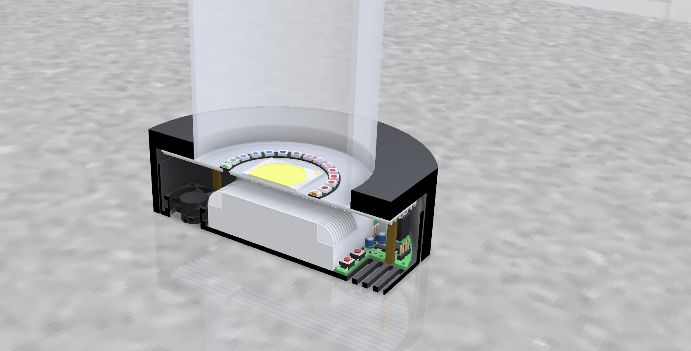

ESP32 Lichtwäcker
===
# Introduction
This repository is about a custom built alarm clock, which wakes you up with light instead of sound. It mimics the sunrise inside your bedroom, so that you are been woken up gently and more natural. The main light source (a.k.a. wake light) is a high power LED with around 50W of power. This is plenty of power to illuminate a big room.

It features a convient Web Interface, where you configure the alarm clock.
You can set the alarm time, the rising time, the maximum LED power and much more.
When a alarm sets in, the brightness is slowly increased (configurable) until the maximum power (configurable) is reached. Then the brightness is held at this point for specific amount of time (configurable).

With the integrated button it is possible to switch off the alarm, activate a "reading light" (low brightness), activate full power or activate the last use RGB Effect.

Beside the high power LED there are 24 WS2812B RGB LED chips arranged in a circle. This makes it possible to use the alarm clock also as a mood or RGB light. It features a lot of effects, that can be selected over the Web Interface.

# Features
The alarm clock has the following features:

- **50W high power LED**
- **High efficient LED driver**
- **ESP32 to control everythin**
- **Custom PCB which implements the electronics**
- **RGB LEDs to create beautiful animations and mood lights**
- **Web Interface to configure the following settings**
  - **Alarm time for each day of the week**
  - **Brightness rising and holding time**
  - **LED power for the wake light**
  - **RGB effect for the mood light**
- **OTA Updates**
- **Alexa and Google Assistant ready ("Alexa, set the alarm light to 20%")**
- **Temperature sensor for the high power LED**
- **Aluminium heat sink with a 30mm fan for cooling**
  - **Fan can switched off, as it obviously makes noise, which is not necessarily desirable when you wake up :)**
- **All parts (beside LED heatsink) are 3D-printable**

## Main LED
___
The mainlight source is a high quality power LED from CREE (CMT2850). It features a CRI of 92, a natural color of 5000K and around 50W of power. It is mounted to the heatsink.
It is driven by an LCM-60 CC-Source from Meanwell. This LED driver has a maximum power output of 60W and can drive a current of max. 1400mA.
For dimming the LED a PWM signal from the ESP32 is used. It is coupled to via an opto-coupler, to prevent GND shifts and other interferences.

## ESP32
___
The alarm clock is powered and controlled over a ESP32. It is mounted on the PCB.

## Other features
___
### Temperature sensor
A LM335 temperature sensor is fixed to the bottom of the heatsink to measure the temperature of the of the main LED. The LM335 outputs an analog voltage which is then measured by an ADC. This method was used over a classic digital OneWire sensor, as the I²C Library is immune to context switches of FreeRTOS. Also, id prevents using a fake DS18B20, as these are very common on AliExpress, eBay etc.

### Fan & heat managment
To enable better cooling of the alarm clock a 30mm fan is used. It is controlled a PWM single, to reduce noise when the temperature is not too hot. In addition, it can completely switched off over the Web Interface.
In both cases a heat managment controls the power of the LED and the fan. The power of the LED is continously reduced, if the the temperature is higher than 70°C.
Thus, the fan can be switched off, resulting in a lower brightness of the LED.

### 

### Hardware

### Firmware
